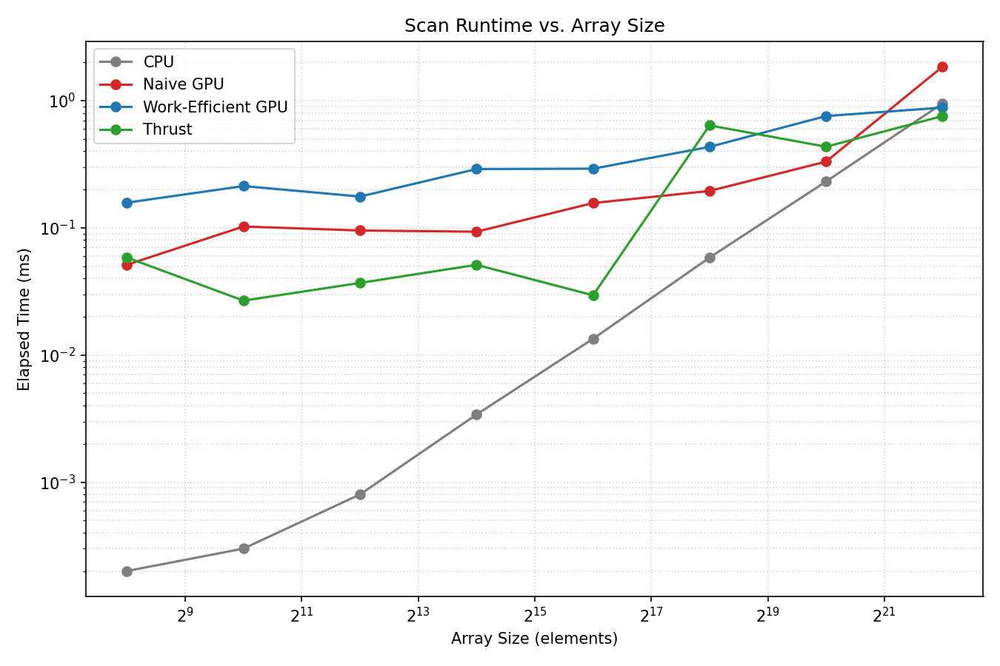

**University of Pennsylvania, CIS 5650: GPU Programming and Architecture,
Project 2 - Stream Compaction**

* Nico Kong
   [LinkedIn](https://www.linkedin.com/in/nicola-kong/), Email: nebfinn@gmail.com
* Tested on: Windows 11, AMD Ryzen AI 9 HX 370 @ 2.0GHz 32GB, RTX 4060 8GB (Personal Laptop)

## Project Description

This project implements CUDA-based Scan for prefix sum and Stream Compaction algorithms.
We compare four methods: Serial CPU method, Naive GPU scan, Work-Efficient GPU scan and Thrust's built-in `exclusive_scan`.
Stream compaction is implemented on the CPU (both with and without using scan) and on the GPU using the work-efficient scan.

### Features Completed

* CPU Scan
* CPU Stream Compaction 
* Naive GPU Scan
* Work-Efficient GPU Scan
* Work-Efficient GPU Stream Compaction
* Thrust Scan

_No extra credit implemented._

### Note

In order to make the project compile on my device, I had to modify
`stream_compaction/CMakeLists.txt`. I ended up
added the following line to force the standards-conforming preprocessor:

```cmake
target_compile_options(stream_compaction PRIVATE "$<$<COMPILE_LANGUAGE:CUDA>:-Xcompiler=/Zc:preprocessor>")
```

## Performance Analysis

### Block Size Optimization

I tested different block sizes on an array with 2^20 entries and got the following results:


| Block Size | Naive (ms) | Work-Efficient (ms) |
|---|---|---|
| 32  | 1.15536 | 0.52832 |
| 64  | 0.56352 | 0.5704 |
| 128  | 0.316992 | 0.432384 |
| 256  | 0.309792 | 0.418592 |
| 512  | 0.415904 | 0.647776 |

Based on this data, I will use 256 as the block size for the implementation comparison below.

### Comparison of Implementations



| Array Size | CPU (ms) | Naive (ms) | Work-Efficient (ms) | Thrust (ms) |
|---|---|---|---|---|
| 256 | 0.0002 | 0.0512 | 0.1577 | 0.05837 |
| 1,024 | 0.0003 | 0.1024 | 0.21299 | 0.02675 |
| 4,096 | 0.0008 | 0.09523 | 0.17613 | 0.03686 |
| 16,384 | 0.0034 | 0.09318 | 0.28979 | 0.05117 |
| 65,536 | 0.0134 | 0.15661 | 0.29165 | 0.02947 |
| 262,144 | 0.0583 | 0.19494 | 0.43309 | 0.63898 |
| 1,048,576 | 0.2313 | 0.33146 | 0.75651 | 0.43424 |
| 4,194,304 | 0.9512 | 1.85088 | 0.88202 | 0.75667 |

### Write-up: Performance Analysis

#### CPU implementation:
Shows a rather linear upwards trend in compute time when increasing array sizes. This is to be expected since our implementation is sequential, and O(n) in runtime and work.
The CPU implementation is faster for smaller arrays, likely because of compiler optimizations on our direct CPU code and the lack of GPU layer indirections - but it quickly gets out-performed with increasingly larger array sizes and is far not as scalable as the GPU implementations are.
#### Naive and Work-efficient implementation:
Both show a slight upwards trend but remain rather consistent for smaller array sizes. notably, Naive starts struggling when array sizes exceed a certain threshold while work-efficient maintains a slow upwards trend. This is also to be expected since the whole point of using our work-efficient algorithm is to improve the theoretical amount of work from O(n log n) to O(n).
#### Thrust implementation:
Has the most inconsistent runtime but overall out performs the other methods. even without looking at the code, we can still identify that there seem to be additional CudaMalloc and CudaMemcpy calls happing inside of the thrust implementation of exclusive_scan, suggesting that there is another layer of indirection hidden in the function we call. This technically makes it an unfair comparison since we always exclude all of these calls in our runtime calculations, and also suggests that there is a MemoryIO bottle neck in our measured data for the thrust implementation.

## Test Program Output

The following output was generated by running tests on an array size of 1000000 and a block size of 256.

```
****************
** SCAN TESTS **
****************
    [   1  35  40  10  33  13   9  22   5  43  20  28  43 ...  22   0 ]
==== cpu scan, power-of-two ====
   elapsed time: 0.2325ms    (std::chrono Measured)
    [   0   1  36  76  86 119 132 141 163 168 211 231 259 ... 25691277 25691299 ]
==== cpu scan, non-power-of-two ====
   elapsed time: 0.2248ms    (std::chrono Measured)
    [   0   1  36  76  86 119 132 141 163 168 211 231 259 ... 25691192 25691227 ]
    passed
==== naive scan, power-of-two ====
   elapsed time: 0.395392ms    (CUDA Measured)
    passed
==== naive scan, non-power-of-two ====
   elapsed time: 0.318656ms    (CUDA Measured)
    passed
==== work-efficient scan, power-of-two ====
   elapsed time: 0.543104ms    (CUDA Measured)
    passed
==== work-efficient scan, non-power-of-two ====
   elapsed time: 0.452768ms    (CUDA Measured)
    passed
==== thrust scan, power-of-two ====
   elapsed time: 0.82944ms    (CUDA Measured)
    passed
==== thrust scan, non-power-of-two ====
   elapsed time: 0.425984ms    (CUDA Measured)
    passed

*****************************
** STREAM COMPACTION TESTS **
*****************************
    [   3   3   2   2   3   1   1   0   3   3   0   0   1 ...   2   0 ]
==== cpu compact without scan, power-of-two ====
   elapsed time: 1.6393ms    (std::chrono Measured)
    [   3   3   2   2   3   1   1   3   3   1   3   2   3 ...   1   2 ]
    passed
==== cpu compact without scan, non-power-of-two ====
   elapsed time: 1.6718ms    (std::chrono Measured)
    [   3   3   2   2   3   1   1   3   3   1   3   2   3 ...   1   1 ]
    passed
==== cpu compact with scan ====
   elapsed time: 2.6753ms    (std::chrono Measured)
    [   3   3   2   2   3   1   1   3   3   1   3   2   3 ...   1   2 ]
    passed
==== work-efficient compact, power-of-two ====
   elapsed time: 0.661504ms    (CUDA Measured)
    passed
==== work-efficient compact, non-power-of-two ====
   elapsed time: 0.498688ms    (CUDA Measured)
    passed
```
