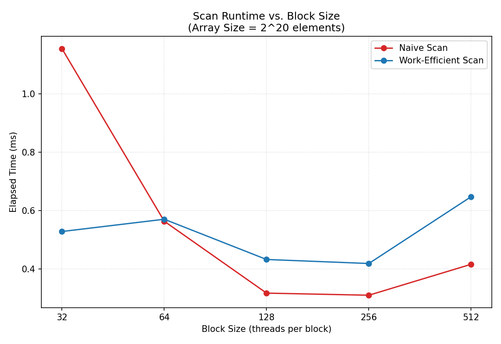

**University of Pennsylvania, CIS 5650: GPU Programming and Architecture,
Project 2 - Stream Compaction**

* Nico Kong
   [LinkedIn](https://www.linkedin.com/in/nicola-kong/), [Email]: nebfinn@gmail.com
* Tested on: Windows 11, AMD Ryzen AI 9 HX 370 @ 2.0GHz 32GB, RTX 4060 8GB (Personal Laptop)

## Project Description

This project implements CUDA-based Scan for prefix sum and Stream Compaction algorithms.
We compare four methods: Serial CPU method, Naive GPU scan, Work-Efficient GPU scan and Thrust's built-in `exclusive_scan`.
Stream compaction is implemented on the CPU (both with and without using scan) and on the GPU using the work-efficient scan.

### Features Completed

* CPU Scan
* CPU Stream Compaction 
* Naive GPU Scan
* Work-Efficient GPU Scan
* Work-Efficient GPU Stream Compaction
* Thrust Scan

_No extra credit implemented._

### Note

In order to make the project compile on my device, I had to modify
`stream_compaction/CMakeLists.txt`. I ended up
added the following line to force the standards-conforming preprocessor:

```cmake
target_compile_options(stream_compaction PRIVATE "$<$<COMPILE_LANGUAGE:CUDA>:-Xcompiler=/Zc:preprocessor>")
```

## Performance Analysis

### Block Size Optimization

I tested different block sizes on an array with ~1'000'000 entries and got the following results:



| Block Size | Naive (ms) | Work-Efficient (ms) |
|---|---|---|
| 32  | 1.15536 | 0.52832 |
| 64  | 0.56352 | 0.5704 |
| 128  | 0.316992 | 0.432384 |
| 256  | 0.309792 | 0.418592 |
| 512  | 0.415904 | 0.647776 |

Best on this data, I will use 256 as the block size for the implementation comparison below.

### Comparison of Implementations

TODO


| Array Size | CPU (ms) | Naive (ms) | Work-Efficient (ms) | Thrust (ms) |
|---|---|---|---|---|
|  |  |  |  |  |
|  |  |  |  |  |
|  |  |  |  |  |
|  |  |  |  |  |

### Write-up: Performance Analysis

TODO

## Test Program Output

```

****************
** SCAN TESTS **
****************
    [  27   7  23  28  43  17  41  10  15  20  39  47  31 ...  34   0 ]
==== cpu scan, power-of-two ====
   elapsed time: 0.0005ms    (std::chrono Measured)
    [   0  27  34  57  85 128 145 186 196 211 231 270 317 ... 6280 6314 ]
==== cpu scan, non-power-of-two ====
   elapsed time: 0.0003ms    (std::chrono Measured)
    [   0  27  34  57  85 128 145 186 196 211 231 270 317 ... 6232 6273 ]
    passed
==== naive scan, power-of-two ====
   elapsed time: 0.18432ms    (CUDA Measured)
    passed
==== naive scan, non-power-of-two ====
   elapsed time: 0.039936ms    (CUDA Measured)
    passed
==== work-efficient scan, power-of-two ====
   elapsed time: 0.3072ms    (CUDA Measured)
    passed
==== work-efficient scan, non-power-of-two ====
   elapsed time: 0.095232ms    (CUDA Measured)
    passed
==== thrust scan, power-of-two ====
   elapsed time: 0.16896ms    (CUDA Measured)
    passed
==== thrust scan, non-power-of-two ====
   elapsed time: 0.026624ms    (CUDA Measured)
    passed

*****************************
** STREAM COMPACTION TESTS **
*****************************
    [   3   1   3   2   3   3   3   0   1   0   3   3   1 ...   2   0 ]
==== cpu compact without scan, power-of-two ====
   elapsed time: 0.0006ms    (std::chrono Measured)
    [   3   1   3   2   3   3   3   1   3   3   1   1   2 ...   2   2 ]
    passed
==== cpu compact without scan, non-power-of-two ====
   elapsed time: 0.0003ms    (std::chrono Measured)
    [   3   1   3   2   3   3   3   1   3   3   1   1   2 ...   3   1 ]
    passed
==== cpu compact with scan ====
   elapsed time: 0.0007ms    (std::chrono Measured)
    [   3   1   3   2   3   3   3   1   3   3   1   1   2 ...   2   2 ]
    passed
==== work-efficient compact, power-of-two ====
   elapsed time: 0.265216ms    (CUDA Measured)
    passed
==== work-efficient compact, non-power-of-two ====
   elapsed time: 0.371712ms    (CUDA Measured)
    passed
```
